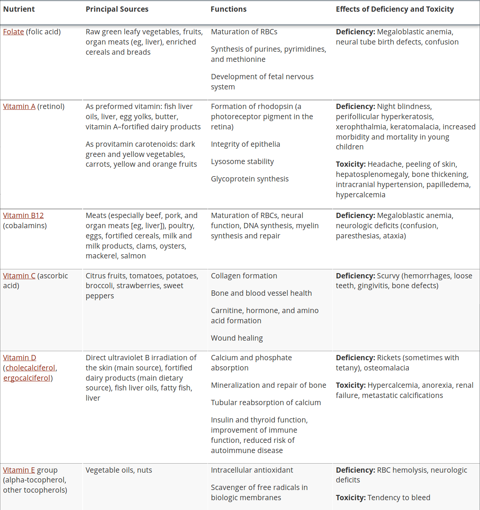

# Main case

## Trigger 1

> 46F, obese

DDx:

-  CVS: heart failure, HTN, atherosclerosis, arrhythmias (AF), AAA, venous thrombosis
-  Resp: OSA, V/Q mismatch, bronchospasm
-  MSK: arthritis, fractures, gout
-  GIT: Ca, hernias, haemorrhoids, gallstones, GORD, non-alcoholic fatty liver, oesophagitis, hernias
-  Repro: infertility, gestational diabetes, sexual arousal issues, polycystic ovarian syndrome
-  Renal: CKD, diabetic nephropathy, hypertensive
-  Infn: decreased immune system, increased skin infn, pressure sores, influenza, candidiasis, stretch marks
-  Metabolic: diabetes, metabolic syndrome

Parameters for regular checkup; specifics depends on what they are complaining about

-  Ex:
    -  Vitals: BP, BMI
    -  Waist circumference
-  Ix:
    -  Blood: cholesterol

BMI: not too gucci for Asians, doesn't apply to children, bodybuilders:

-  [25, 30): overweight
-  [30, $\infty$): obese

## Trigger 2

Insert curtis image

T2D:

-  $\beta$-cells: make insulin
-  Insulin resistance
-  $\beta$-cells hypertrophy, hyperplasia => decompensate and hypotryphy
-  Want people to change diet, exercise, lose weight

Obesity: $\Uparrow$ serum triglycerides => $\Uparrow$ intracellular triglycerides => inhibit insulin signalling => acquired insulin resistance. Adipose tissues => secrete adipokines => IL-1$\beta$ 

HbA1c: percentage of glycated RBC, gives measure of blood glucose over longer time

## Trigger 3

Obesity: SUFE is more likely

Ask pt: "what do *you* like doing?", "what are you capable of doing?"

## Trigger 4

Complications of T2D:

Curtis image

Metformin:

-  $\Downarrow$liver gluconeogenesis
-  $\Downarrow$intestinal glucose absorption
-  $\Uparrow$peripheral glucose uptake

## Trigger 5

Regulation of hunger: flowchart from Curtis

T2D: AUSDRISK questionnaire provides risk of developing diabetes, repeat every 3 years + fasting glucose xor HbA1c

## Trigger 6

Metabolic syndrome = $5\times\text{risk of T2D}$

# Short case 1

## Trigger 1

DDx weight loss:

-  COPD
-  Ca
-  Depression
-  Malabsorption
-  Malnutrition
-  Coeliacs
-  Infn
-  Toothache/swallowing
-  Medications
-  Financial problems

Physiological elderly issues

-  Loss of taste receptors
-  Dysphagia
-  Decrease resting metabolic rate
-  Sedentary behaviour => muscle wasting
-  Stroke
-  Increased insulin resistance
-  Senescent cells => secrete proinflamm cytokines
-  Comorbidities

Hx:

-  How he coping with bereavment
-  HPC: what does he eat, is he struggling eating, noticed any other symptoms (pain, parasthesia), how is he feeling, sleep, dentures
-  Systems review: bowel habits, fever nightsweats chills
-  PMHx: recent illnesses
-  Medications/allergies/smoking/alcohol

## Trigger 2

Sig weight loss:

-  5% over 6/12
-  Any unintentional in adults or pt is concerned about

Nutrition state: MNA (mini nutrition assessment) takes about 15min

## Trigger 3

Ix:

-  Bloods: FBC, ELFT (albumin decreased in malnutrition), TSH, Vitamins, iron studies, ESR/CRP

## Trigger 4

Heading toward microcytic anaemia

Age at risk for Ca

Elderly deficiency:

-  Vit D
-  Ca
-  B vitamins
-  Fe
-  Zn: immune system

# Short case 2

## Trigger 1

> 9M, referred to paed from GP, few/12 weakness in legs becoming progressively worse, complaining muscle pain, located calves and backs of knees, affecting daily activities, gums bleed when he cleans his teeth

Hx:

-  HPC: when did it start, what is time frame for progression, pain/10, has this happened before, what made them come in today out of all things
-  Further neuro Hx: change diff times of the day/temperature/exertion, bowel bladder function, any other sensory, vision/voice/chewing/swallowing/SOB, cognitive changes, 
-  any organ systems
-  PMHx/PSHx: how was birth, is child intellectually normal, 
-  FHx
-  Allergies, medications, drugs
-  Social Hx: diet, exercise

DDx lower limb weakness and pain:

-  CVS: vasculitis, stroke, infn
-  MSK: trauma, muscular dystrophies, myositis, rhabdomyolysis, trichinosis (infn => secondary myopathy), *lyme disease*, *conn tissue diseases* (SLE, RA), sarcoidosis => secondary myopathy
-  Neuro: seizures, tumour (brain, spinal cord, sensory level), GBS, myasthenia,
-  Systemic: scurvy, organophosphate or carbamate poisoning (NMJ), anaemia, alcohol toxicity, Vit B12 deficiency, thyroid/adrenal dysfn, *heavy metal poisoning*, *leukaemia*
-  GIT:
-  Iatrogenic: corticosteroids, AZT, statins, colchicine

DDx gingival bleeding: coagulopathies, infn

-  GIT: autoimmune hepatitis, hepatites (infn, toxic/alcoholic)
-  Genetic: $\alpha_{1}$-antitrypsin deficiency => cirrhosis
-  Systemic: adrenal/thyroid issues (adrenal insufficiency), Vit C deficiency, haemophilia, *leukaemia*, thrombocytopaenia
-  Trauma: vigorous brushing
-  Periodontitis: infn of gums and bones, gingivitis, 

Ex:

-  General inspection: pallor, jaundice, (un)well
-  Vitals + growth
-  Neuro Ex: muscle wasting, tone, strength, reflexes, coordination, sensation
-  MSK?
-  Check inside his mouth
-  CVS: check pulses for peripheral vasculature
-  GIT: check for hepatomegaly (cause of a lot of issues), jaundice

## Trigger 2

> Looks unwell, 9 years 3 mo, 26kg 137cm, skin rough in texture, Ex all normal

Charts:

-  Weight: (10, 25)
-  Height: (50, 75)
-  BMI: 13.85263

Bruising: contusion

-  Damage to vessels (capillaries, sometimes venules)
-  Blood extravasates into interstitium
-  Does not leak past skin, so can see it
-  Should heal within 3 to 4 weeks
-  Non-blanching?

Relationship of bruise:

-  Coagulopathy
-  Falling over due to weakness
-  Child abuse

Ix:

-  Bloods: FBC (Hb, WCC) + microscopy, ELFT (check for hepatocellular injury), TSH (thyroid fn), coag panel, micronutrients blood test (Vit C, B12, folate, Vit A)

## Trigger 3

> Scurrrrrrrrrrrrrrrrrrrrrvy

RDA (recommended daily allowance/intake): set to meet the needs of 97-98% of healthy individuals.  
Adequate intake (AI): not enough data for RDA then observer healthy people and use that.  
Tolerable upper intake level (UL): $max\text{(Intake)}$ without adverse health effects.

Micronutrients: required in small quantities for life, generally less than $100mg/day$, act as cofactors, needed, antioxidants,...

Vitamins: fat soluble = {A, D, E, K}, or water soluble = (B, C}

Vit C deficiency:

-  Required for collagen, hormone, aa formation, wound healing, burn recovery, antioxidant, iron absorption
-  Pathophys: human body cannot make Vit C => can be depleted in 1-3/12 without any intake as body's stores get depleted from environment/oxidation => conn tissue (collagen) defective => poor wound healing in collagen containing tissues such as skin, cartilage, osteoid, capillaries, gum (haemorrhage), hair follicles. Bone tissue formation impaired (endochondral ossification)=> poor growth. Also affects haematopoiesis by enhancing Fe absorption to Fe^3+^
-  Also is a cofactor for metabolism of tyrosine and cholesterol, synthesis of neurotransmitters (noradrenalin), peptide hormones, corticosteroids, aldosterone
-  Signs/symptoms: weakness, irritability, weight loss, vague myalgies/arthralgias
-  Risk factors: alcoholics (metabolised in liver), food fads, elderly, economically disadvantaged (no fresh food/vege), refugees, pregnant, eating disorders (anorexia), aids, T1D (increased requirement for Vit C), SI diseases (crohns, coeliacs, gastric bypass)
-  Dx: usually clinical (skin/gingival findings, risk factors), FBC for anaemia, bleeding/coag/prothrombin are normal
-  Treat with supplemental ascorbic acid and a nutritious diet.

## Trigger 4

> kms

