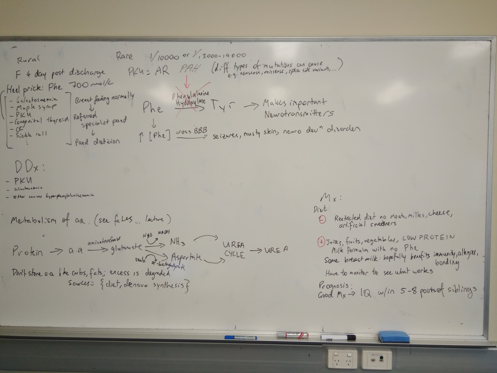

# Main case

## Trigger 1

DDx reduced consciousness: [AEIOU-TIPS](https://en.wikipedia.org/wiki/AEIOU-TIPS) is a mnemonic

-  DKA
-  Hypoglycaemia
-  Drugs, toxins
-  Alcohol
-  Trauma
-  Malnutrition
-  Meningitis
-  Vascular: haemorrhages, stroke
-  Tumour
-  Hypoxia
-  Epilepsy/seizures
-  Dehydration

Consciousness = arousal (ascending reticular activating system; dorsal brainstem) + cognition (orientation, judgement, memory; cerebral cortex)

GCS: arousal; MMSE: cognition

##  Trigger 2

Flu: can cause serious complications such as pneumonia, myocarditis, encephalitis, kidney failure (exacerbate problems). They are not always in YOPI individuals, can be in young healthy patients. 

Weight loss: malabsorption, bullimia, anorexia, no insulin (=> glycogenolysis, gluconeogenesis => glucosuria + polydipsia (from dehydration))

Thirst: hypovolaemia, hyperosmotic

## Trigger 3

Ix:

-  Bloods: FBC, ELFT (Na, K), blood glucose, dipstick
-  ABG
-  ECG

## Trigger 4

Hyperkalaemia: starts leaking (intra => extra) as insulin helps reuptake and cannot reabsorb, after treatment can quickly become hypokalaemic

DKA Dx:

-  ABG: pH
-  Dipstick: glycosuria
-  Bloods

Rarer in T2D: people still have insulin => still can stop glycolysis (ketone production)

## Trigger 5

## Trigger 6

Mx:

-  Manage blood glucose
-  3/12 HbA1c

Diet: less alcohol as alcohol is metabolised preferentially

# Short case 1

## Trigger 1

> 5/12M ED sweating, trembling

Sweating: hypothalamus => sympathetic regulation => postgang *ACh* receptors (instead of noradrenaline)

Hx:

-  PC: recent illness, normal nappies, is he growing normally, "how do you feed him?"
-  4-6/12 start introducing solids, around 1 year stop breast feeding (or continue within reason)
-  PMHx: congenital, birth complications, vaccinations
-  FHx: anything
-  SHx:

Ex:

-  General inspection
-  Vitals: temperature, *glucose*,
-  CVS/resp
-  GIT
-  Everything

## Trigger 2

Ix:

-  Bloods: FBC, ELFT, TSH
-  USS

## Trigger 3

Learn fasting state:

-  $\Uparrow$Glycogenolysis: Glycogen => G6P (G6P-ase) => Glucose
-  $\Uparrow$Lipolysis
-  $\Uparrow$Gluconeogenesis

[Corn starch: wiki page of gsd 1a](https://en.wikipedia.org/wiki/Glycogen_storage_disease_type_I)

# Short case 2

